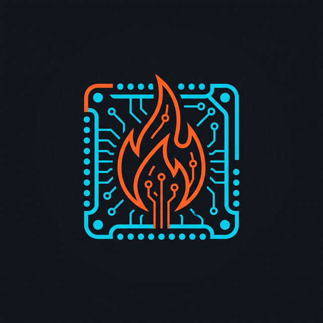
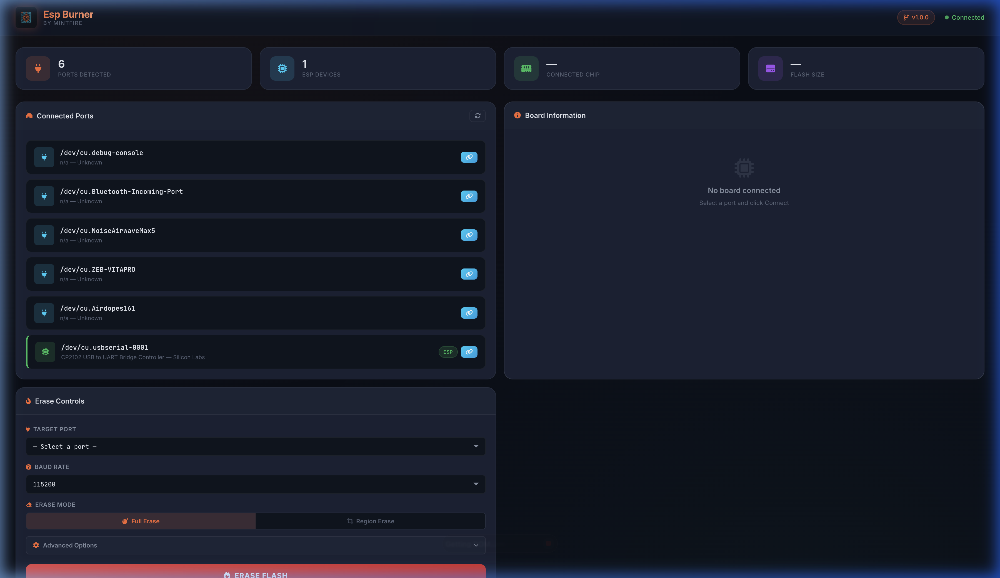
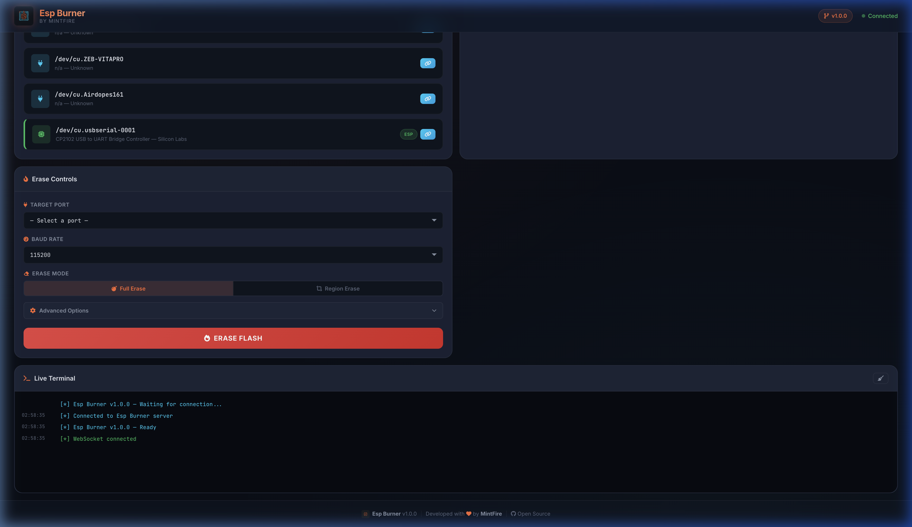
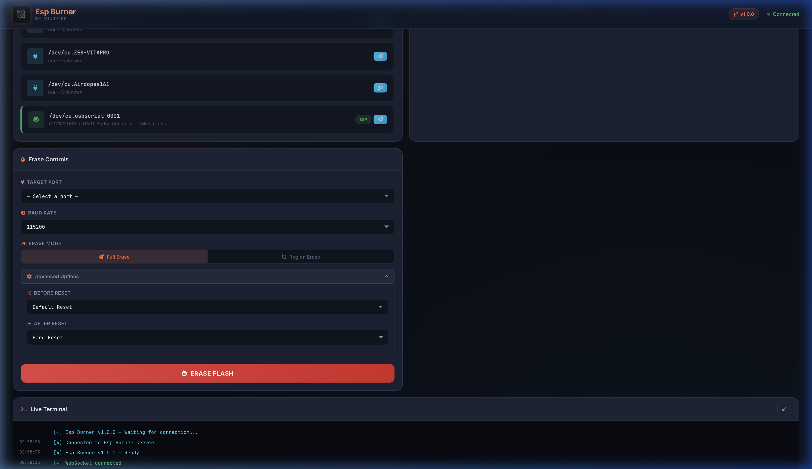
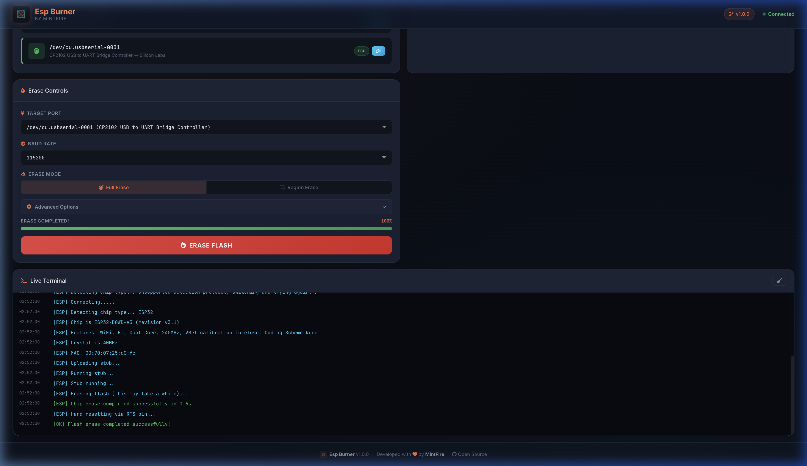
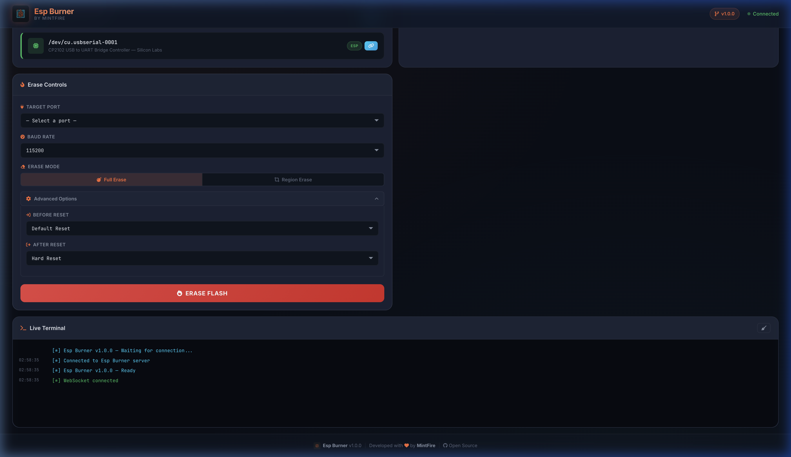
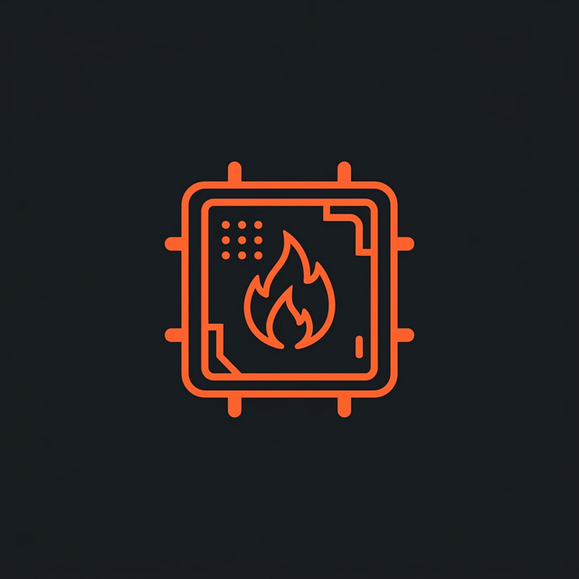

<div align="center">



# ⚡ Esp Burner

### _Professional ESP Board Flash Memory Eraser_

<br>

[](https://github.com/mintfire/esp-burner)
[](https://python.org)
[](https://flask.palletsprojects.com/)
[](https://github.com/espressif/esptool)
[](LICENSE)

<br>

[](https://github.com/mintfire/esp-burner)
[](https://github.com/mintfire/esp-burner)
[](https://github.com/mintfire/esp-burner)
[](https://github.com/mintfire/esp-burner)
[](https://socket.io)
[](https://github.com/mintfire)

<br>

> **Erase. Reset. Reflash.** A production-grade web application for securely erasing ESP microcontroller flash memory — with real-time monitoring, advanced controls, and a stunning dark-themed dashboard.

<br>

---

</div>

## 📸 Screenshots

<div align="center">

### 🖥️ Dashboard Overview



<br><br>

### 🔥 Erase Controls & Advanced Options

<table>
<tr>
<td width="50%">

<p align="center"><em>Full Erase / Region Erase Toggle</em></p>
</td>
<td width="50%">

<p align="center"><em>Advanced Reset & Baud Rate Options</em></p>
</td>
</tr>
</table>

<br>

### ✅ Successful Erase Operation



<br><br>

### 💻 Live Terminal Output



</div>

<br>

---

## 🎬 Demo

<div align="center">

> Watch a full erase operation in action — from port detection to flash wipe completion!


<em>ESP32-D0WD-V3 • Full Flash Erase • Completed in 0.6 seconds</em>

</div>

<br>

---

## ✨ Features

<table>
<tr>
<td width="50%">

### 🔌 Hardware Detection
- **Auto Port Discovery** — Real-time USB monitoring
- **ESP Chip Identification** — Type, MAC, flash size, crystal
- **Live Device Events** — Plug/unplug notifications
- **Smart ESP Detection** — Identifies CP210x, CH340, FTDI chips

</td>
<td width="50%">

### 🔥 Flash Operations
- **Full Flash Erase** — One-click complete wipe
- **Region Erase** — Selective memory erasure (hex address + size)
- **9 Baud Rates** — 9600 to 921600
- **Reset Modes** — Default, USB, No Reset, Soft Reset

</td>
</tr>
<tr>
<td width="50%">

### 📡 Real-Time Communication
- **WebSocket** — Live progress & log streaming
- **Auto-Reconnect** — Infinite retry on disconnect
- **REST API Fallback** — Works even if WebSocket fails
- **Port Auto-Polling** — Every 3 seconds via REST

</td>
<td width="50%">

### 🎨 Premium UI
- **Dark Theme** — Deep navy with glassmorphism
- **Font Awesome 6** — Professional icons (no emojis)
- **Responsive** — Desktop, tablet, mobile
- **Micro-Animations** — Smooth transitions & hover effects

</td>
</tr>
</table>

<br>

---

## 🌐 Cross-Platform Support

Esp Burner is a **web-based tool** that runs on any platform with Python and a web browser.

| Platform | Access Method | Notes |
|----------|:-------------|-------|
| **🪟 Windows** | `http://localhost:5001` | Install CP210x/CH340 drivers, run with `python app.py` |
| **🍎 macOS** | `http://localhost:5001` | Drivers usually auto-installed, run with `python3 app.py` |
| **🐧 Linux** | `http://localhost:5001` | Add user to `dialout` group for serial access |
| **📱 Android** | `http://<PC_IP>:5001` | Connect to same WiFi, open in Chrome/Firefox |

### 📱 Android / Mobile Access

Since Esp Burner binds to `0.0.0.0`, you can access it from **any device on the same network**:

```bash
# 1. Find your computer's local IP
#    Windows: ipconfig | findstr IPv4
#    macOS:   ipconfig getifaddr en0
#    Linux:   hostname -I

# 2. Start the server
python3 app.py

# 3. On your Android/iOS device, open browser and navigate to:
#    http://192.168.x.x:5001
```

> **Note:** ESP boards must be physically connected to the machine running Esp Burner. Mobile devices can only control the erase operation remotely.

<br>

---

## 🛠️ Tech Stack

```
┌─────────────────────────────────────────────────────┐
│  Frontend                                           │
│  ├── HTML5 + CSS3 (Dark Glassmorphism Theme)        │
│  ├── Vanilla JavaScript (No framework overhead)     │
│  ├── Socket.IO Client (WebSocket + Polling)         │
│  ├── Font Awesome 6 (CDN)                           │
│  └── Google Fonts (Inter + JetBrains Mono)          │
├─────────────────────────────────────────────────────┤
│  Backend                                            │
│  ├── Python 3.8+ / Flask 3.x                        │
│  ├── Flask-SocketIO (Real-time communication)       │
│  ├── esptool 4.x (ESP flash operations)             │
│  ├── pyserial (Serial port management)              │
│  └── eventlet (Async networking)                    │
└─────────────────────────────────────────────────────┘
```

<br>

---

## 📂 Project Structure

```
Esp Boot Burner/
├── 📄 app.py                      # Flask server + esptool integration
├── 📄 requirements.txt            # Python dependencies
├── 📄 README.md                   # You are here
├── 📁 docs/
│   └── 📁 screenshots/            # README screenshots & demo
├── 📁 static/
│   ├── 📁 css/
│   │   └── 📄 style.css           # Premium dark-theme stylesheet
│   ├── 📁 js/
│   │   └── 📄 main.js             # Frontend logic + WebSocket
│   └── 📁 img/
│       ├── 🖼️ logo.png            # Esp Burner logo
│       └── 🖼️ favicon.png         # Browser favicon
└── 📁 templates/
    └── 📄 index.html              # Dashboard SPA
```

<br>

---

## 🚀 Quick Start

### Prerequisites

| Requirement | Version | Notes |
|-------------|---------|-------|
| Python | 3.8+ | [Download](https://python.org) |
| pip | Latest | Included with Python |
| USB Driver | — | CP210x / CH340 / FTDI (for your ESP board) |

### Installation

<details>
<summary><b>🪟 Windows</b></summary>

```powershell
# Clone the repository
git clone https://github.com/mintfire/esp-burner.git
cd esp-burner

# Create virtual environment
python -m venv venv
venv\Scripts\activate

# Install dependencies
pip install -r requirements.txt

# Launch
python app.py
```

> Install [CP210x drivers](https://www.silabs.com/developers/usb-to-uart-bridge-vcp-drivers) if your ESP board uses a Silicon Labs USB chip.

</details>

<details>
<summary><b>🍎 macOS</b></summary>

```bash
# Clone the repository
git clone https://github.com/mintfire/esp-burner.git
cd esp-burner

# Create virtual environment
python3 -m venv venv
source venv/bin/activate

# Install dependencies
pip install -r requirements.txt

# Launch
python3 app.py
```

> macOS usually auto-installs USB drivers. If not, install [CH340 drivers](https://github.com/adrianmihalko/ch340g-ch34g-ch34x-mac-os-x-driver).

</details>

<details>
<summary><b>🐧 Linux (Ubuntu/Debian)</b></summary>

```bash
# Install Python & serial port access
sudo apt update
sudo apt install python3 python3-venv python3-pip
sudo usermod -aG dialout $USER  # Reboot required after this

# Clone the repository
git clone https://github.com/mintfire/esp-burner.git
cd esp-burner

# Create virtual environment
python3 -m venv venv
source venv/bin/activate

# Install dependencies
pip install -r requirements.txt

# Launch
python3 app.py
```

> After adding yourself to the `dialout` group, **log out and log back in** for changes to take effect.

</details>

<details>
<summary><b>📱 Android (Remote Access)</b></summary>

```bash
# On your PC (Windows/Mac/Linux):
# 1. Follow the installation steps for your OS above
# 2. Start the server
python3 app.py

# 3. Find your PC's local IP address
#    Windows: ipconfig
#    macOS:   ifconfig | grep "inet "
#    Linux:   hostname -I

# 4. On your Android device:
#    Open Chrome/Firefox and go to http://YOUR_PC_IP:5001
#    Example: http://192.168.1.100:5001
```

> Both your PC and Android must be on the **same WiFi network**. The ESP board stays plugged into the PC.

</details>

<br>

After launching, open **http://localhost:5001** in your browser.

<br>

---

## 🔧 Usage Guide

### Step 1: Connect Your ESP Board

Plug your board into a USB port. Esp Burner **automatically detects** new devices and shows them in the dashboard.

### Step 2: Select & Identify

Click the **Connect** button on your device to fetch chip information — or directly select it from the **Target Port** dropdown.

### Step 3: Configure Erase

| Option | Description |
|--------|-------------|
| **Full Erase** | Wipe the entire flash memory |
| **Region Erase** | Erase a specific address range (hex) |
| **Baud Rate** | Communication speed (115200 recommended) |
| **Before Reset** | Reset behavior before erase begins |
| **After Reset** | Reset behavior after erase completes |

### Step 4: Erase

Click **ERASE FLASH** → Review the confirmation modal → Click **Erase Now**

Monitor progress in real-time through the progress bar and Live Terminal.

<br>

---

## 📡 API Reference

<details>
<summary><b>REST Endpoints</b></summary>

| Endpoint | Method | Description |
|----------|--------|-------------|
| `/` | `GET` | Dashboard UI |
| `/api/ports` | `GET` | List serial ports |
| `/api/board-info` | `POST` | Get ESP chip info |
| `/api/erase` | `POST` | Start erase operation |
| `/api/status` | `GET` | App status |

</details>

<details>
<summary><b>WebSocket Events</b></summary>

| Event | Direction | Payload |
|-------|-----------|---------|
| `connected` | Server → Client | `{ message, version }` |
| `ports_changed` | Server → Client | `{ ports[], added[], removed[] }` |
| `erase_log` | Server → Client | `{ message, type }` |
| `erase_progress` | Server → Client | `{ progress, status }` |
| `erase_complete` | Server → Client | `{ success, message }` |
| `request_ports` | Client → Server | — |

</details>

<br>

---

## 🔌 Supported ESP Boards

| Board | Chip | Flash | Status |
|-------|------|-------|:------:|
| ESP32 DevKit | ESP32-D0WD | 4MB | ✅ |
| ESP32-S2 | ESP32-S2 | 4MB | ✅ |
| ESP32-S3 | ESP32-S3 | 8-16MB | ✅ |
| ESP32-C3 | ESP32-C3 | 4MB | ✅ |
| ESP32-C6 | ESP32-C6 | 4MB | ✅ |
| ESP32-H2 | ESP32-H2 | 4MB | ✅ |
| NodeMCU | ESP8266 | 4MB | ✅ |
| ESP-01 | ESP8285 | 1MB | ✅ |

<br>

---

## 🐛 Troubleshooting

<details>
<summary><b>❌ No ports detected</b></summary>

- Install USB-to-UART drivers: [CP210x](https://www.silabs.com/developers/usb-to-uart-bridge-vcp-drivers) | [CH340](https://github.com/adrianmihalko/ch340g-ch34g-ch34x-mac-os-x-driver) | [FTDI](https://ftdichip.com/drivers/)
- On Linux, add user to `dialout` group: `sudo usermod -aG dialout $USER`

</details>

<details>
<summary><b>❌ Connection timed out</b></summary>

Put your ESP board in **download mode**:
1. Hold the **BOOT** button
2. Press and release **RESET**
3. Release **BOOT**

> Some boards (with CP2102N or auto-reset circuits) handle this automatically.

</details>

<details>
<summary><b>❌ Port is busy</b></summary>

- Close Arduino IDE, PlatformIO, or any other serial monitors
- On macOS: `lsof | grep /dev/cu.usb` to find the blocking process
- Esp Burner has built-in retry logic — it will wait up to 7.5s for the port to free up

</details>

<details>
<summary><b>❌ Erase fails at high baud rate</b></summary>

Try reducing baud rate to **115200** or **57600**. Some USB cables don't support high-speed communication reliably.

</details>

<br>

---

## 🤝 Contributing

We welcome contributions! Here's how to get started:

```bash
# Fork & clone
git clone https://github.com/YOUR_USERNAME/esp-burner.git

# Create a feature branch
git checkout -b feature/amazing-feature

# Make your changes, then commit
git commit -m "feat: add amazing feature"

# Push & open a Pull Request
git push origin feature/amazing-feature
```

### Commit Convention

| Prefix | Usage |
|--------|-------|
| `feat:` | New feature |
| `fix:` | Bug fix |
| `docs:` | Documentation |
| `style:` | UI/CSS changes |
| `refactor:` | Code restructuring |
| `test:` | Adding tests |
| `chore:` | Maintenance |

<br>

---

## 🔒 Security

- **Local-only** — All operations run on `localhost`
- **No telemetry** — Zero data sent to external servers
- **Confirmation required** — Erase needs explicit user approval
- **Port validation** — Only connects to verified serial devices

<br>

---

## 📜 License

This project is licensed under the **MIT License** — see the [LICENSE](LICENSE) file for details.

<br>

---

<div align="center">



**Esp Burner** `v1.0.0`

_Built with precision by **[MintFire](https://github.com/mintfire)**_

_Erase. Reset. Reflash._

<br>

[](https://github.com/avik-root/ESP-Burner/)
[](https://github.com/avik-root/ESP-Burner/fork)

<sub>© 2026 MintFire — All rights reserved.</sub>

</div>
